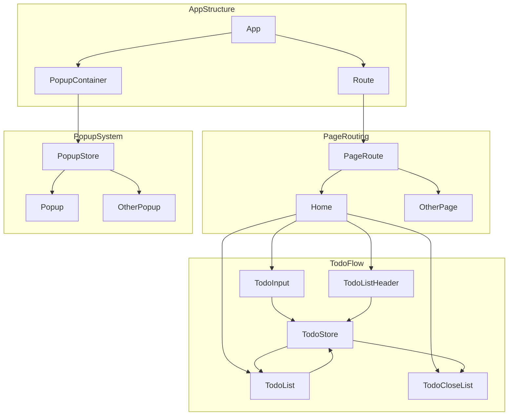

# Millie 프로젝트 UML 다이어그램

Mermaid를 이용하여 다이어그램을 그렸습니다.

### 1. AppStructure

프로젝트의 진입점인 App은 Route와 PopupContainer를 포함합니다.
Route는 페이지 전환을, PopupContainer는 상태 기반 팝업 관리를 담당합니다.

### 2. PageRouting

라우팅 시스템은 PageRoute에 따라 Home 또는 기타 페이지를 렌더링합니다.

### 3. Store

스토어 시스템으로 전역적인 상태관리를 합니다.

### 4. TodoFlow

Home 페이지는 Todo 관련 컴포넌트로 구성되며, 각 컴포넌트는 TodoStore를 통해 상태를 주고받고 조건에 따라 UI를 업데이트합니다.

## 앱 흐름도

## TodoFlow 흐름도

```mermaid
flowchart TD
    subgraph TodoInputFlow [할 일 추가 흐름]
        TI[TodoInput] --> VL["Validate 입력 검증"]
        VL --> TS1["TodoStore: todoList 업데이트"]
        TS1 --> TS_NOTIFY1["TodoStore 상태 변경"]
        TS_NOTIFY1 --> TL[TodoList 항목 추가]
    end

    subgraph EditFlow [할 일 수정]
        TI2["TodoItem 할 일 수정"] --> CD2[CountDown 일시정지] --> TS2["TodoStore: todoList 업데이트"]
        TS2 --> TS_NOTIFY2["TodoStore 상태 변경"]
        TS_NOTIFY2 --> TL2[TodoList 수정된 항목 렌더링, CountDown 재생]
    end

    subgraph CompleteFlow [할 일 삭제]
        TI3["TodoItem 삭제"] --> TS3["TodoStore: todoList, todoCloseList 업데이트"]
        TS3 --> TS_NOTIFY3["TodoStore 상태 변경"]
        TS_NOTIFY3 --> TL3[TodoList 항목 삭제]
        TS_NOTIFY3 --> TCL[TodoCloseList 항목 추가]
    end

    subgraph AutoCloseFlow [시간 종료 시 완료 처리]
        CD[CountDown 완료] --> TI4["TodoItem: timeCloseFn"]
        TI4 --> TS4["TodoStore: todoList, todoCloseList 업데이트"]
        TS4 --> TS_NOTIFY4["TodoStore 상태 변경"]
        TS_NOTIFY4 --> TCL2[TodoCloseList Todo 항목 추가]
        TS_NOTIFY4 --> TL4[TodoList Todo 항목 삭제]
        TS_NOTIFY4 --> PC["PopupContainer 종료 Popup 노출"]
    end

    subgraph SortFlow [정렬 변경]
        TLH2["TodoListHeader (정렬 선택)"] --> TS5["TodoStore: setSortType"]
        TS5 --> TS_NOTIFY5["TodoList 리렌더링"]
        TS_NOTIFY5 --> TL5[TodoList 정렬]
    end
```

